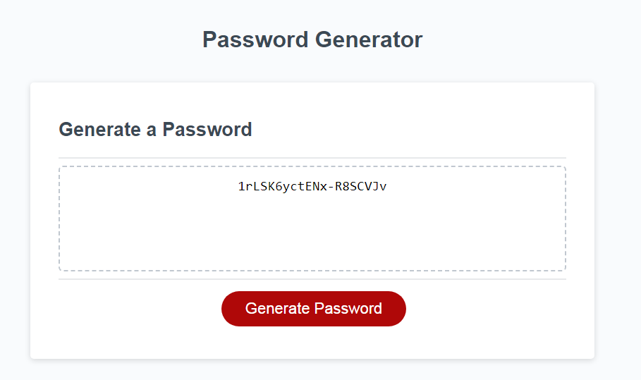

# Generate-Password
## The application for generating password
 
### What problem does it solve?

```
This page can be used to generate diffrent password :
1. You can create it only with numbers
2. Create it with numbers and lower case.
3. Use numbers, lower and upper case
4. Lastly, create hard password with 4 types
```

### What can you learn, creating it?

* How to use prompt
* How to create few similar functions with diffrent results
* How to call one function instead others
* How to use methods .random, .floor, .concat etc
* How and when to use loop and conditions
* How to create button and use it for calling function

* The Password Generator

